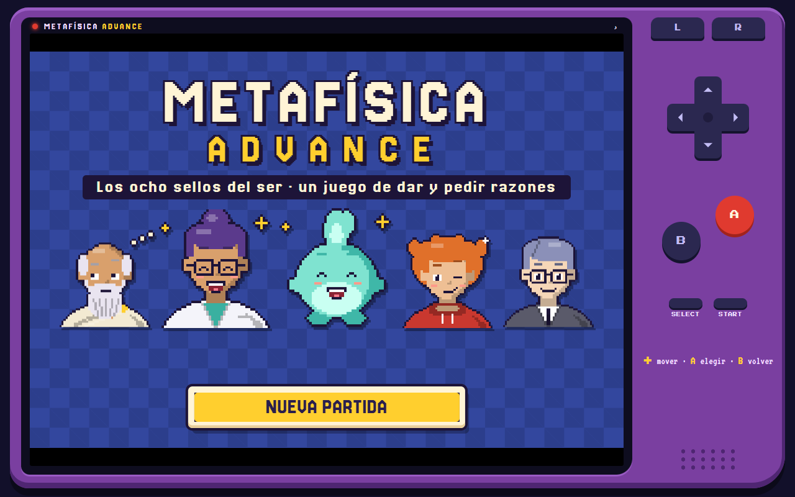
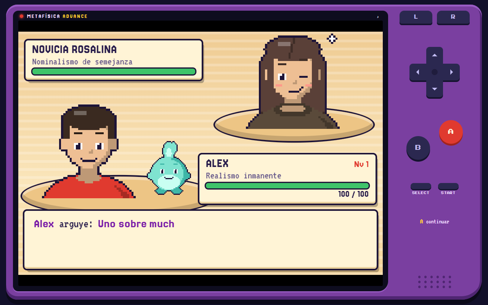
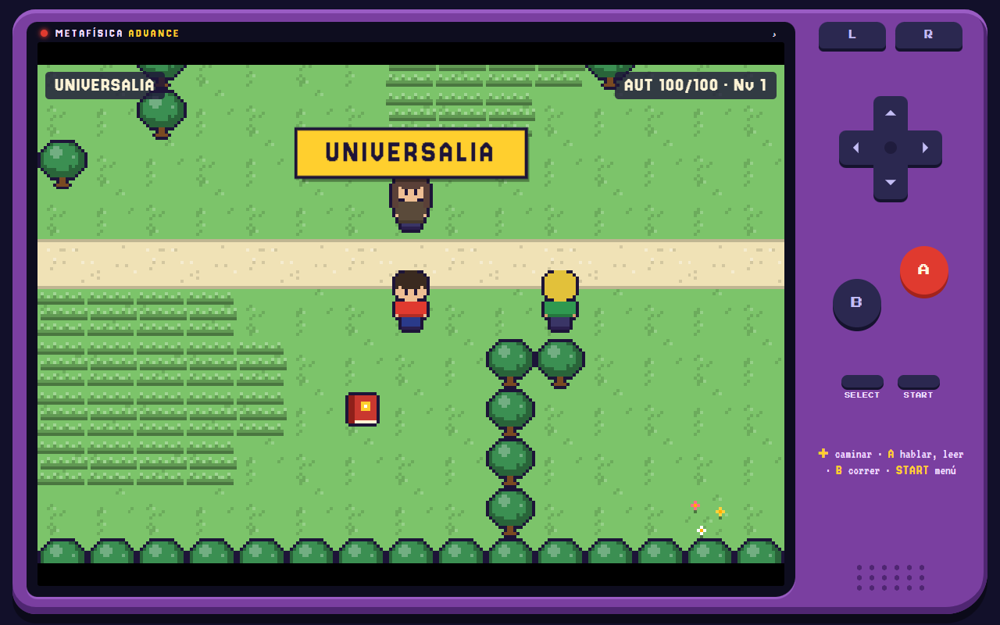

# Metafísica Advance

Juego de rol con aspecto de consola portátil para aprender metafísica. Recorres una región donde cada pueblo vive obsesionado con un problema, coleccionas teorías, argumentos y conceptos, y ganas disputas contra quienes defienden otras posturas.

**Jugar:** https://ontoterrorist.github.io/metafisica-advance/

## Cómo se juega

Las disputas son un juego de dar y pedir razones. Cada quien defiende una postura y queda comprometido con lo que de ella se sigue. Gana quien deja al otro sin autorización para sostener su tesis.

| Acción | Qué hace |
|---|---|
| Argüir | Lanza un argumento. Solo es eficaz si es una objeción contra la postura rival; usarlo contra la tuya es una incoherencia |
| Pedir razones | Examina un compromiso del rival: qué se sigue de él y con qué es incompatible |
| Concepto | Prepara una distinción, afina el próximo argumento o recupera autorización |
| Postura | Muestra el marcador de compromisos y permite cambiar de teoría |

Cuando te objetan puedes replicar con el concepto adecuado. Si sostienes lo mismo que tu rival, no hay disputa: sin incompatibilidad no hay nada que discutir.

Las ideas sueltas viven en la hierba alta. Si respondes bien una pregunta sobre una, se queda en tu Ontodex.

## La región

| Pueblo | Problema | Líder |
|---|---|---|
| Universalia | Universales | Platón |
| Numeria | Números y objetos abstractos | Frege |
| Causalia | Causalidad | Hume |
| Cronópolis | Tiempo | McTaggart |
| Puerto Teseo | Persistencia | Heráclito |
| Modalia | Modalidad | David Lewis |
| Mereópolis | Composición | Leśniewski |
| Villa Albedrío | Libre albedrío | Laplace |
| Meseta Metaontológica | Metaontología | Carnap |

Son 134 cartas: 30 teorías, 63 argumentos y 41 conceptos. En cada pueblo eliges una postura y puedes cambiarla después. El menú «Mi sistema» muestra qué posturas tuyas se apoyan entre sí y cuáles están en tensión.

## Controles

| Consola | Teclado |
|---|---|
| Cruceta | Flechas |
| A | Z o Intro |
| B (correr, volver) | X o Esc |
| START (menú) | P |
| SELECT (pista en una disputa) | Retroceso |
| Sonido | M |

En el teléfono se juega con los botones de la pantalla y se puede instalar como app desde el menú del navegador. La partida se guarda sola en el dispositivo.
